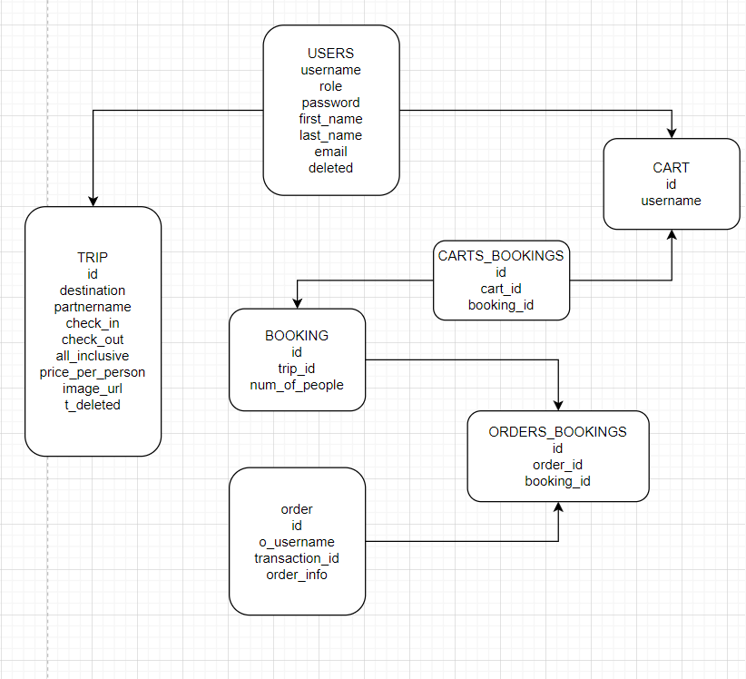

# Travel agency backend

Description:
- Travel agency site is a platform for purchasing and selling trips(like airbnb for traveling). Users have to register to be able shop on this platform and they can chose role to be user or partner. 

Technology stack:
- react
- node.js
- express
- psql database 

Features: 
- CRUD operations with database
- users authorization 
- validation constraints of JSON data
- error handling
- braintree payment system

